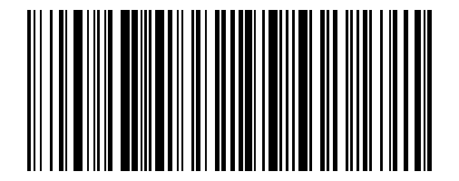
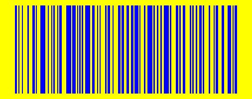

# 𝄃𝄃𝄂𝄂𝄀𝄁𝄃𝄂𝄂𝄃 Generador de Códigos de Barras y Códigos QR con colores personalizados.

Este repositorio contiene una implementación para generar códigos de barras y códigos QR con opciones de personalización de colores.

<br>

## Instalación

Para instalar las dependencias necesarias, ejecuta:

```bash
pip install python-barcode pillow qrcode[pil]
```

<br>

## Ejemplo código de barras
``` python
import pyBarcodeQRGen

# Barcode Generation Example
data = "Example Barcode String"  # Cualquier string que quieras almacenar
bar_color = (0, 0, 0)  # Color de las barras
bg_color = (255, 255, 255)  # Color de fondo
output_file = "barcode-example.png" # Nombre del archivo de salida

#pyBarcodeQRGen.generate_barcode(data, bar_color, bg_color, output_file)
print(f"Código de barras guardado en {output_file}")
```

| Ejemplo                          |
|----------------------------------|
|  |

| Ejemplo color 1                         | Ejemplo color 2                         | Ejemplo color 3                         |
|----------------------------------|----------------------------------|----------------------------------|
|  |  |  |

<br>

## Ejemplo código QR
``` python
import pyBarcodeQRGen

# QR Generation Example
data = "Example QR String"  # String que quieras almacenar en el código QR
bar_color = (0, 0, 0)  # Color de las barras
bg_color = (255, 255, 255)  # Color de fondo
output_file = "qrcode-example.png"  # Nombre del archivo de salida

pyBarcodeQRGen.generate_qr_code(data, bar_color, bg_color, output_file)
print(f"Código QR guardado en {output_file}")
```

| Ejemplo                          |
|----------------------------------|
|  |

| Ejemplo color 1                         | Ejemplo color 2                         | Ejemplo color 3                         |
|----------------------------------|----------------------------------|----------------------------------|
|  |  |  |
